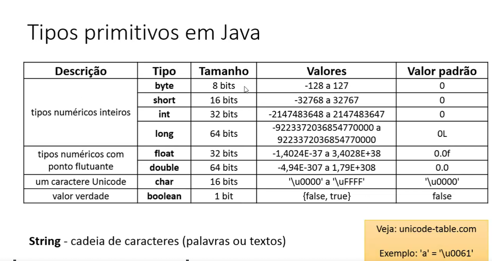

### TIPAGEM DE VARIÁVEL

int  = inteiro;
double = número com pontos flutuantes;
char = caractere único;

sintaxe de declaração de variável
<tipo> <nome> = <valor inicial>;

ex: int age = 28
    double altura  = 1.68;
    char sexo = 'F';

### TIPOS PRIMITIVOS EM JAVA

## INTEIROS 
byte = 8 bits;
short = 16 bits;
int = 32 bits;
long = 64 bits;

## PONTOS FLUTUANTES (casas decimais)
float = 32 bits;
double = 64 bits; (usado para representar números quebrados pq ele é um número maior que pode armazenar números maiores e com maior precisão)

## CARACTERES UNICODE
char = 16 bits;

## VALOR VERDADE
boolean = 1 bit;

1 bit pode armazenar 2 valores: 0 ou 1;
2 bits podem armazenar 4 valores: 00, 01, 10, 11;

String = não é um tipo primitivo, mas é uma classe que representa uma sequência de caracteres.

### [SAÍDA_DE_DADOS[AULA_23]]

System.out.print("Olá, Mundo!"); [sem_quebra_de_linha]
System.out.println("Olá, Mundo!"); [com_quebra_de_linha_ao_final]